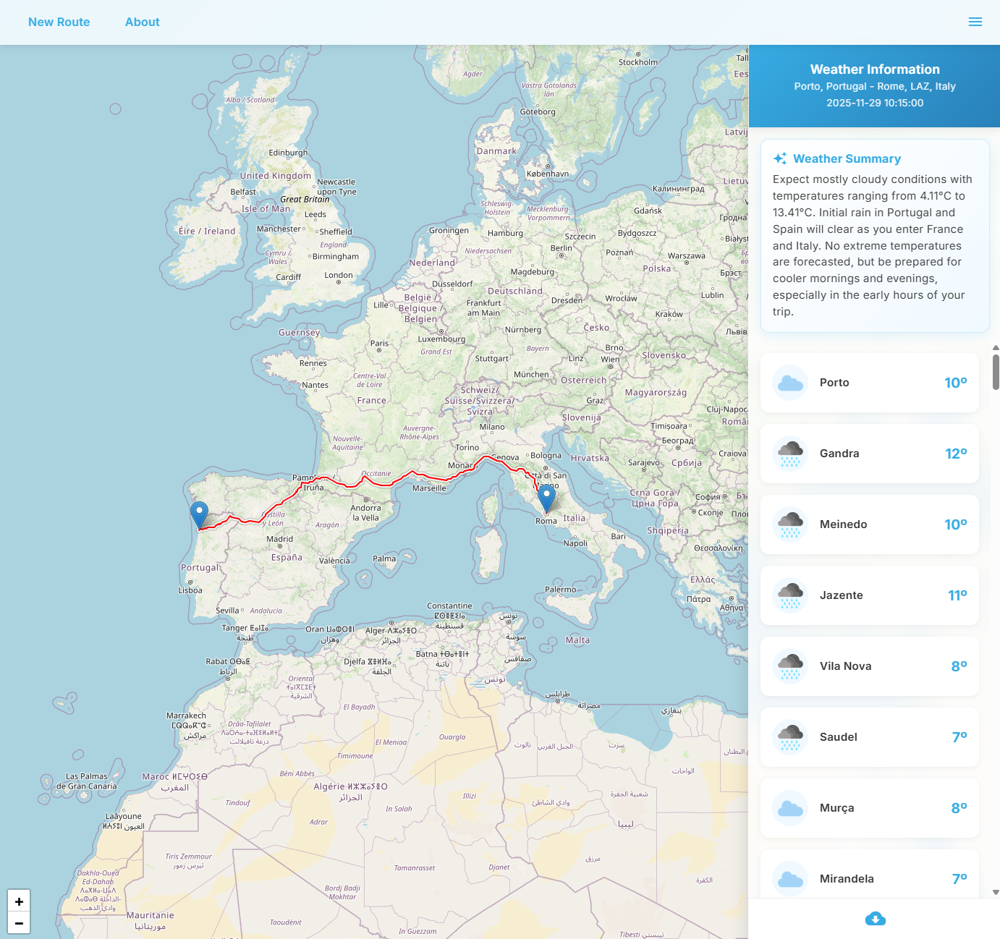
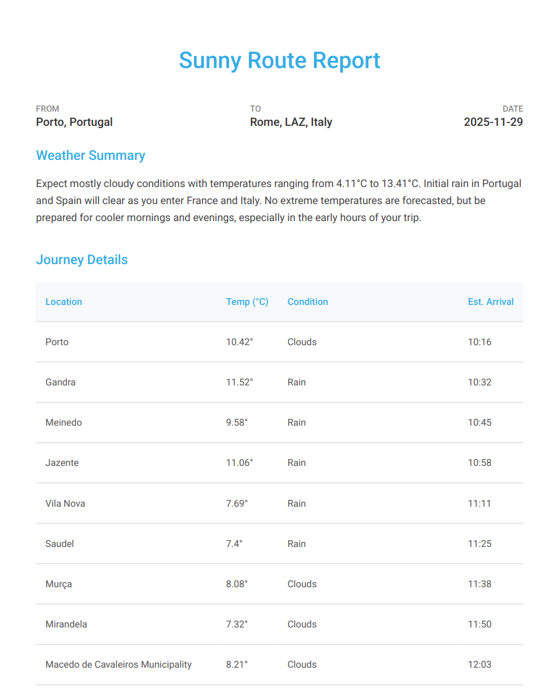

#  Sunny Route

**Sunny Route is a smart travel companion that helps you plan your road trips by showing you the weather forecast along your route.**

## Features ✨

-   **Smart Route Planning**: Calculate the best route between two locations.
-   **Weather Along the Way**: View weather forecasts for key points on your journey, calculated based on your estimated arrival time.
-   **Journey Visualization**: A beautiful, glassmorphism-inspired UI that visualizes your trip.
-   **PDF Reports**: Download a detailed PDF report of your route and weather conditions.
-   **Responsive Design**: Works perfectly on desktop and mobile devices.

## How it works 🛠️

1. Choose a departure location and time, and an arrival location.


2. Visualize the shortest route between the chosen departure and arrival locations and view the weather information expected at certain points on the generated route.



Tip: You can **share the link** generated by Sunny Route to share the route and appropriate weather information with those who will be making the trip with you!

3. There is also the possibility to download a PDF with all the generated meteorological information!



## How to run 🚀

1.  **Clone the repository**
    ```bash
    git clone https://github.com/ruijramos/Sunny-Route.git
    cd Sunny-Route
    ```

2.  **Install dependencies**
    ```bash
    npm install
    ```

3.  **Configure Environment Variables**
    -   Copy the example environment file:
        ```bash
        cp src/app/environments/environment.example.ts src/app/environments/environment.ts
        ```
    -   Open `src/app/environments/environment.ts` and add your API keys:
        -   **OpenWeatherMap**: Get a key from [openweathermap.org](https://openweathermap.org/).
        -   **Geoapify**: Get a key from [geoapify.com](https://www.geoapify.com/).
        -   **OSRM**: The public server is configured by default, but you can use your own instance.

4.  **Run the application**
    ```bash
    npm start
    ```
    Navigate to `http://localhost:4200/`.

## External APIs 🔗

1.  **[OSRM](https://project-osrm.org/)**: For routing and driving time calculations.
2.  **[OpenWeatherMap](https://openweathermap.org/)**: For accurate weather forecasts.
3.  **[Geoapify](https://www.geoapify.com/)**: For location autocomplete and geocoding.
4.  **[Nominatim](https://nominatim.org/)**: For reverse geocoding.

## Tech Stack 💻

<div>
  &nbsp;
  &nbsp;
  &nbsp;
  &nbsp;
</div>
